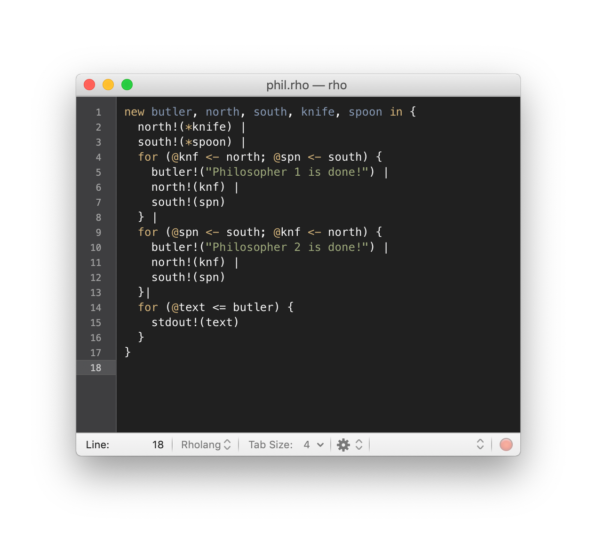

# Rholang for TextMate

## Installation
You can install this bundle in TextMate by double clicking on the downloaded `Rholang.tmbundle` file.

## Credits
Heavily based upon [tgrospic's Sublime Text bundle](https://github.com/tgrospic/rholang-sublime).

## License
[The MIT License (MIT)](LICENSE)
